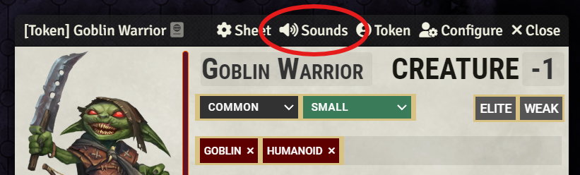
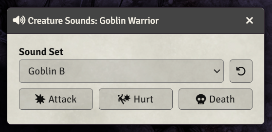
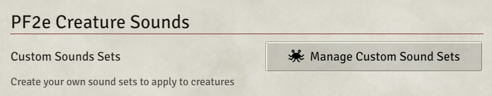
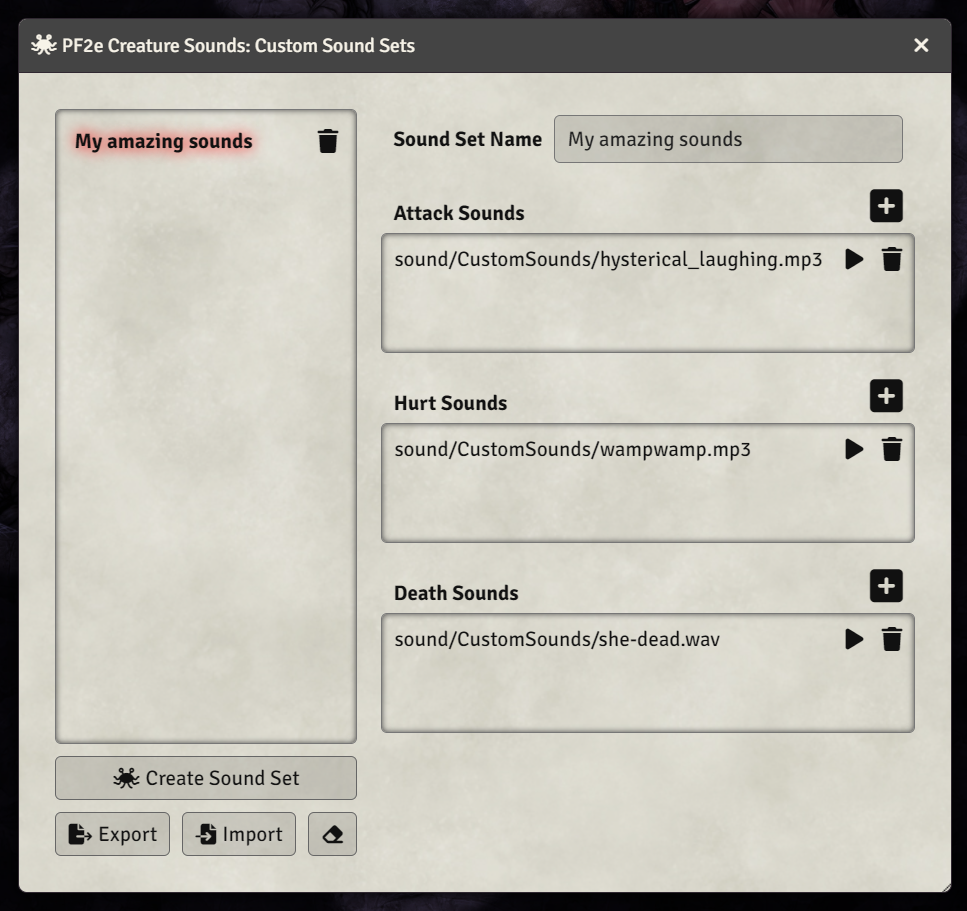

# PF2e Creature Sounds

This module adds sounds when creatures or characters attack, are damaged, or are killed. Many sound sets are included, covering creatures from dragons to sprites, aberrations to
insects, and many different humanoids.

The module attempts to find an appropriate sound set using a creature's name, traits, and size -
for example, a tiny fiend will use the "Imp" sound set by default. If a match can't be
found, or if you want to choose a different set, you can pick the sounds used with a selector, and
you can even create your own sound sets by uploading sound files.

## Previewing or choosing sound sets

Click on Sounds in the header bar of a character sheet (NPC or Player) to open the sound select
dialog.

In the dialog that appears, you can see the currently selected sound set. Use the buttons to preview sounds for Attack, Hurt, and Death, and use the drop-down to select a different sound set.

By default, players can change sounds for actors they own, but as the GM you can turn off this
ability in the settings if you can't trust your players not to all sound like ducks and elephants
(don't message me if your party is actually composed of all ducks and elephants).

## Adding custom sound sets

If you have your own sound files and are the GM, you can create custom sound sets for use with
players or monsters.

In the module settings, click the Manage Custom Sound Sets button.

In the window that opens, click 'Create sound set' to add a new sound set, give it a name, and
click the plus buttons beside Attack Sounds, Hurt Sounds, and Death Sounds to upload and select your
sound files.

The new sound set is saved automatically, and will appear at the bottom of the drop-down in
the sound select dialog.

You can also Export all your custom sound sets so that you can Import them into another world, or
just as a backup, but please note that this does not back up your actual sound files, just the sound
set definition.